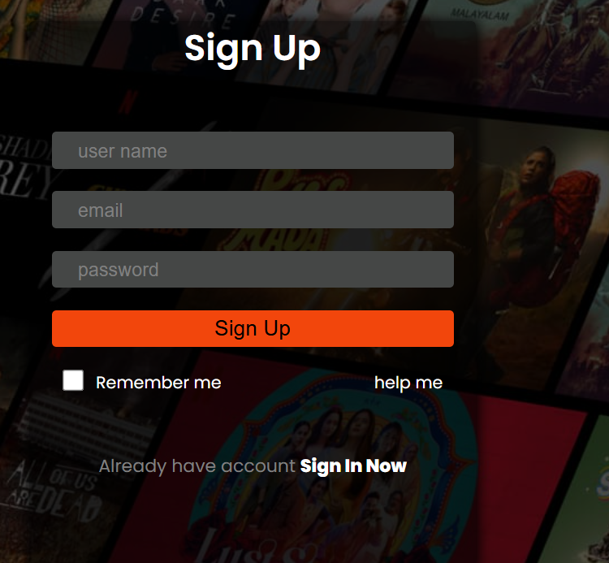
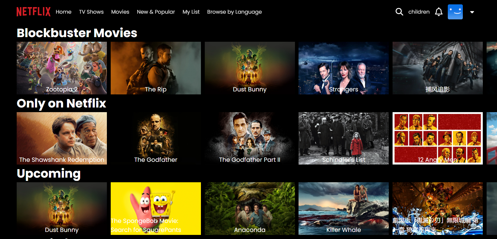
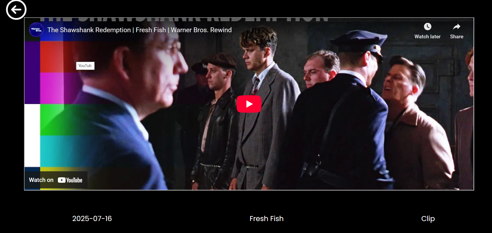

🎬 Netflix Clone
A full-stack Netflix Clone web application built using React (Vite) for frontend,
Express.js for backend, MySQL for database, and TMDB API for movie data.

🚀 Features
User Sign In authentication
Netflix-style Home page
Dynamic movie rows using TMDB API
Movie player page
Responsive UI
REST API based backend
MySQL database integration
🛠️ Tech Stack
Frontend
React.js (Vite)
JavaScript
HTML5
CSS3
Backend
Node.js
Express.js
Database
MySQL
External API
TMDB (The Movie Database) API
📁 Project Folder Structure
NETFLIX_CLONE │ ├── BackEnd │ ├── node_modules │ ├── db.js │ ├── index.js │ ├── package.json │ └── package-lock.json │ ├── FrontEnd │ ├── node_modules │ ├── public │ ├── src │ │ ├── assets │ │ ├── component │ │ │ ├── Footer │ │ │ ├── NavBar │ │ │ └── TitleCard │ │ ├── Page │ │ │ ├── Home │ │ │ ├── Login │ │ │ └── Player │ │ ├── App.jsx │ │ ├── index.css │ │ └── main.jsx │ ├── index.html │ ├── package.json │ ├── package-lock.json │ └── vite.config.js │ ├── .gitignore ├── eslint.config.js └── README.md

🔐 Authentication Flow
User enters email and password on Login page
Frontend sends request to Express backend
Backend checks credentials from MySQL database
Success or error response is returned
On success, user navigates to Home page
🎬 TMDB API Usage
Fetch trending and popular movies
Display movie posters dynamically
Show movies category-wise
⚙️ Installation & Setup
1️⃣ Clone the Repository
git clone https://github.com/your-username/netflix-clone.git
2️⃣ Backend Setup
cd BackEnd
npm install
node index.js
Make sure MySQL is running and database credentials are correct in db.js

3️⃣ Frontend Setup
cd FrontEnd
npm install
npm run dev
🔮 Future Enhancements
JWT based authentication

Sign Up functionality

Search movies

Watchlist feature

Trailer popup

Deployment on cloud (Render / Vercel)

👨‍💻 Author
Shivanand Kailas Dabhade
Computer Engineering Student
Full-Stack Developer

⭐ Support
If you like this project, don’t forget to give it a ⭐ on GitHub!

---

## ✅ Important Final Checks

✔ `README.md` is in **root folder**  
✔ Folder names match GitHub exactly (`BackEnd`, `FrontEnd`)  
✔ No screenshots yet → add later (optional but powerful)

---

If you want next:
- 📸 **Add screenshots section**
- 🧠 **Make README more placement-oriented**
- 🎯 **SPPU mini-project format**
- 🚀 **Deployment steps**

Just tell me 👍
::contentReference[oaicite:0]{index=0}

## 📸 Screenshots

### 🔐 Login Page

### 🏠 Home Page

### ▶ Player Page

